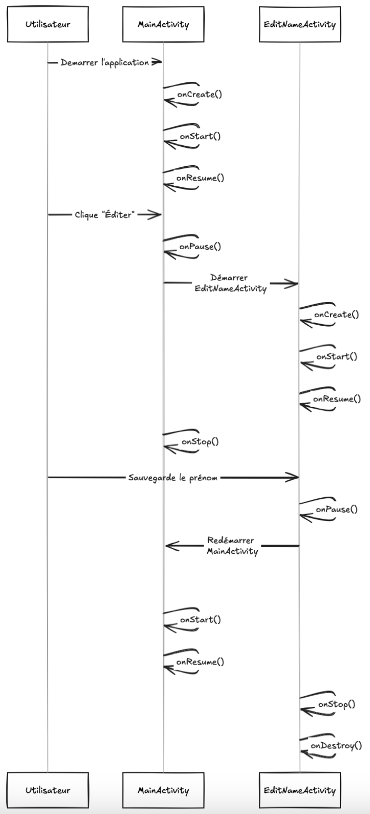
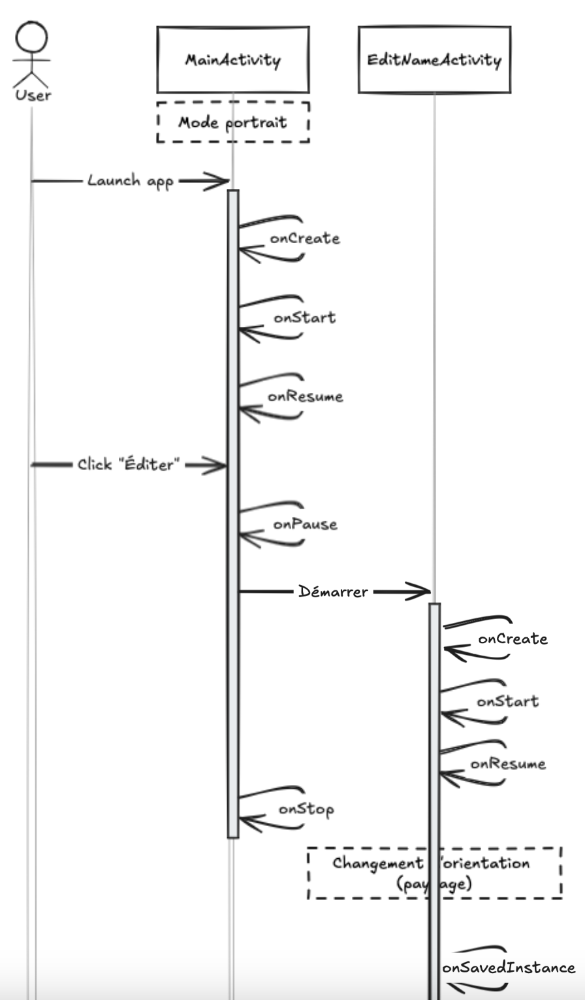
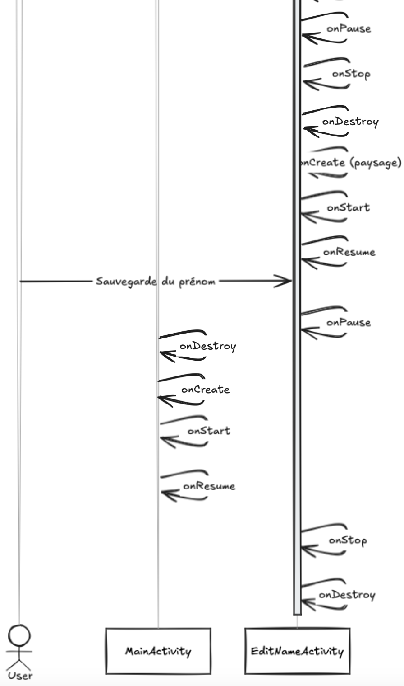

# Activity Management 
## Auteurs : Bugna, Slimani & Steiner

## Question 1:

Que se passe-t-il si l’utilisateur appuie sur « back » lorsqu’il se trouve sur la seconde Activité ?

### Réponse 1:

Si l'utilisateur appuie sur le bouton 'back' alors qu'il est sur la seconde Activité, Android appelle automatiquement la méthode 'finish()' de cette Activité. Cela fermera l'Activité actuelle et ramènera l'utilisateur à l'Activité précédente, ou au parent de cette Activité, selon la pile de back stack. En l'absence d'autres Activités dans la pile de retour, l'application peut retourner à l'écran d'accueil. 

## Question 2.1:

Veuillez réaliser un diagramme des changements d’état des deux Activités pour les utilisations suivantes, vous mettrez en évidence les différentes instances de chaque Activité 

\- L’utilisateur ouvre l’application, clique sur le bouton éditer, renseigne son prénom et sauve.

### Réponse 2.1:




\- L’utilisateur ouvre l’application en mode portrait, clique sur le bouton éditer, bascule en mode paysage, renseigne son prénom et sauve.

### Réponse 2.2:

Le diagramme est en deux images car il est long.

#### partie 1:




#### partie 2



## Question 3:

Que faut-il mettre en place pour que vos Activités supportent la rotation de l’écran ? Est-ce nécessaire de le réaliser pour les deux Activités, quelle est la différence ?

### Réponse 3:

Pour permettre à une Activité de supporter la rotation de l'écran, il est essentiel de sauvegarder les données critiques en utilisant la méthode 'onSaveInstanceState()' et de restaurer ces données dans 'onCreate()'. Cela permet de maintenir l'état de l'interface utilisateur même lorsque l'orientation de l'écran change. En ce qui concerne la gestion des deux Activités, la première Activité pourrait nécessiter une gestion différente des données utilisateurs saisis si celles-ci doivent être transférées entre différentes Activités ou fragments.


# Les Fragments 

## Question 1:

Les deux Fragments fournis implémentent la restauration de leur état. Si on enlève la sauvegarde de l'état sur le ColorFragment sa couleur sera tout de même restaurée, comment pouvons-nous expliquer cela ?

### Réponse 1:

La couleur du ColorFragment peut être restaurée malgré la suppression explicite de la sauvegarde de l'état grâce au mécanisme de gestion automatique de l'état des Fragments. En effet, Android dispose d'un mécanisme intégré qui conserve l'état des vues essentielles d'un Fragment, y compris des éléments d'interface utilisateur tels que la couleur d'un élément visuel. Cette sauvegarde est gérée par le framework lui-même en utilisant le bundle 'savedInstanceState'. Même si l'on n'implémente pas manuellement la restauration de l'état, Android peut automatiquement sauvegarder certains aspects de l'état visuel (comme la couleur) lorsque la rotation de l'écran ou un changement de configuration se produit.

## Question 2:

Si nous plaçons deux fois le CounterFragment dans l'Activité, nous aurons deux instances indépendantes de celui-ci. Comment est-ce que la restauration de l’état se passe en cas de rotation de l’écran ?

### Réponse 2:

Lorsque deux instances indépendantes de CounterFragment sont créées dans l'activité, chaque instance gère son propre état indépendamment. En cas de rotation de l'écran, Android sauvegarde l'état de chaque instance de Fragment dans un bundle 'savedInstanceState' correspondant. Lors de la restauration, Android restaure l'état de chaque instance de manière séparée. Cela signifie que les deux Fragments conserveront leurs états respectifs et restaureront correctement leurs compteurs ou autres données spécifiques lors de la recréation de l'interface utilisateur après la rotation de l'écran. 

 

# FragmentManager 

## Question 1:

A l’initialisation de l’Activité, comment peut-on faire en sorte que la première étape s’affiche automatiquement ? 

### Réponse 1:

Pour que la première étape s'affiche automatiquement lors de l'initialisation de l'activité, il faut vérifier dans la méthode 'onCreate()' si un Fragment existe déjà dans le container. Si aucun Fragment n'est encore affiché, on peut utiliser le FragmentManager pour ajouter le premier Fragment dans le container. Voici un exemple de code :

```Kotlin
 if (savedInstanceState == null) {
     // Ajouter le premier fragment à l'initialisation de l'activité
     getSupportFragmentManager().beginTransaction()
       .add(R.id.fragment_container, new FirstFragment())
       .commit();
   }
```


## Question 2:

Comment pouvez-vous faire en sorte que votre implémentation supporte la rotation de l’écran ? Nous nous intéressons en particulier au maintien de l’état de la pile de Fragments et de l’étape en cours lors de la rotation. 

### Réponse 2:

Pour supporter la rotation de l'écran tout en maintenant l'état de la pile de Fragments, il est recommandé d'utiliser le 'FragmentManager' qui gère déjà la sauvegarde de l'état des Fragments dans un bundle par défaut. Si les Fragments sont ajoutés à la 'back stack', ils seront automatiquement restaurés après la rotation. Cependant, il est important de gérer explicitement les états spécifiques des Fragments (comme les variables) en utilisant 'onSaveInstanceState()' dans les Fragments et en restaurant ces valeurs lors de 'onCreate()'.

## Question 3:

Dans une transaction sur le Fragment, quelle est la différence entre les méthodes add et replace ? 

### Réponse 3:

La méthode 'add()' permet d'ajouter un Fragment au container sans supprimer le Fragment existant, ce qui permet de superposer plusieurs Fragments ou d'ajouter plusieurs Fragments dans une même pile. La méthode 'replace()' supprime l'ancien Fragment et le remplace par le nouveau Fragment spécifié. Cela signifie que 'replace()' ne permet d'avoir qu'un seul Fragment visible à la fois dans le container, alors que 'add()' peut ajouter un nouveau Fragment tout en laissant l'ancien actif ou visible si les conditions le permettent.x	